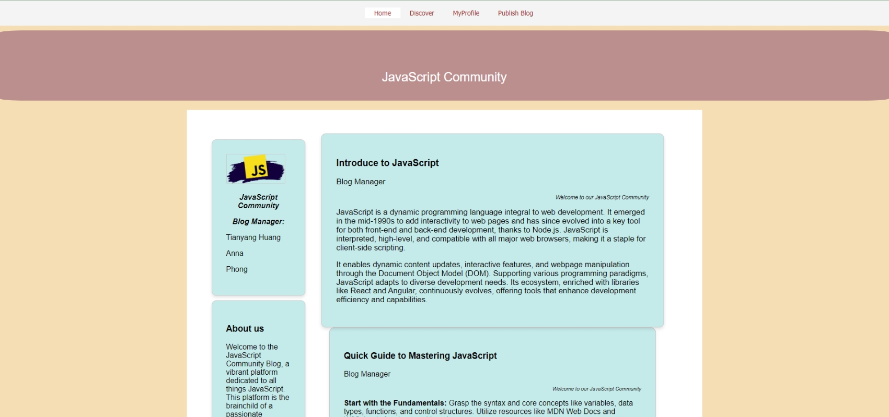

<h3>How does it work?</h3>

  •	Collaborated with 2 team members to research and analyze user requirements and to develop a responsive blog platform website through GitHub.  
  •	Applied PHP functions to execute SQL DML queries, enabled search and filtering functions, and allowed users to add/display/remove content seamlessly. 
  •	Used DOM manipulation and added EventListener in JavaScript to construct user-side form validation dynamically and show clear error messages. 
  •	Conducted manual testing for the Blog Website project to ensure all functionalities met user requirements. 

 
<h3 align="left">Web Site Plan</h3>

  

 
<h3 align="left">How it looks like?</h3>

  

 

  

  
